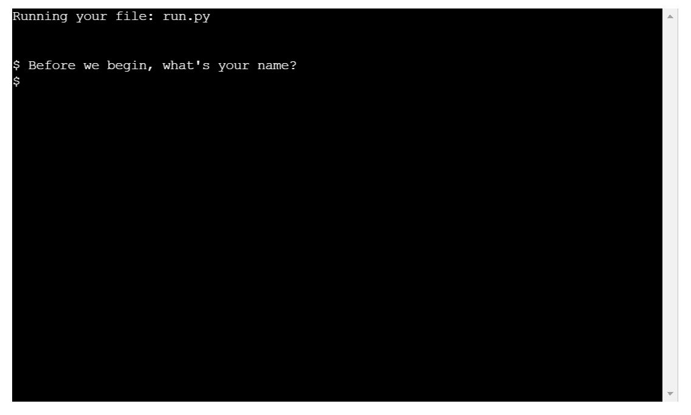
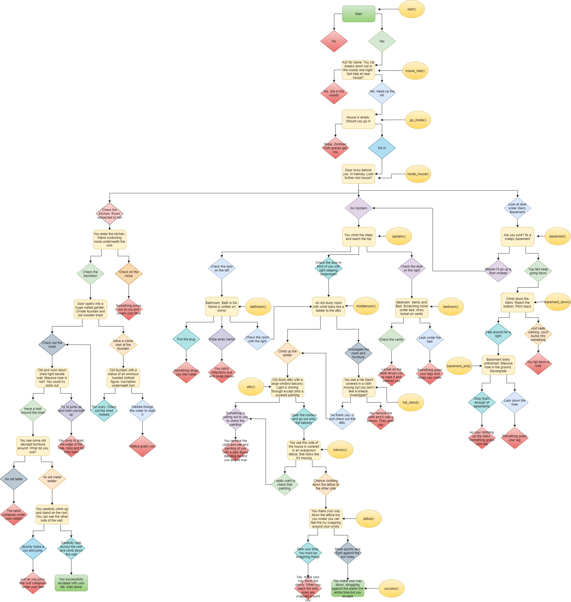

Haunted House
=====

Haunted House is a Python terminal game which runs in the Code institute mock terminal on Heroku

Users can make their own choices in this choose your own adventure story by reading and selecting various options that they will be presented with

How to play
======

Haunted House is based on choose your own adventure books. Specifically the Goosebumps Reader Beware, you choose the scare books by R.L.Stine

The user is initally greeted by a start promt where they enter their name and then consent to playing

From there the user is presented with an original story about a Haunted house where they are given the choice to follow whatever narrative they desire

The user is in control of how the story plays out and in order to successfully escape the haunted house the user must make all the right decisions

When making a choice the user will either be asked to enter Yes or No to some questions and A, B or C to other questions

Features
======

### Play Game button

<ul>
<li>Lets the user start the game</li>
<li>Allows the user to restart the game at any stage they like</li>
</ul>

### Terminal area

<ul>
<li>Displays text for the user to read and interact with</li>
<li>Gives a space for users to input their data</li>
</ul>

### Program structre

<ul>
<li>To plan my project I used a flowchart to help keep track all of the branching narratives of the story and to keep them in one place</li>
<li>I also wrote the name of the functions beside the corresponding room to help follow along when coding esier</li>
</ul>

### Future Features

<ul>
<li>Plans to add more story text and to create more choices and options</li>
<li>Plans to refactor code to make it more adaptable for other potential stories</li>
<li>Plans to make the terminal size bigger to display larger chunks of text</li>
</ul>

Technologies Used
======

### Languages

<ul>
<li>Python</li>
</ul>

### Frameworks & Tools

<ul>
<li>Git</li>
<li>GitHub</li>
<li>Gitpod</li>
<li>Google Documents</li>
<li>Heroku</li>
<li>https://app.diagrams.net/</li>
</ul>

Testing
======

## Validator Testing

#### PEP8
No errors were returned when passing through the PEP8 code validator

## Manual Testing

I have manually tested this project by doing the following:
<ul>
<li>Passed the code through a a PEP8 linter and confirmed there were no problems</li>
<li>Given invalid inputs such as numbers when strings are expected, out of bounds inputs or the same input twice</li>
<li>Checked if all my indentation was correct and that the text lines weren't too long</li>
<li>Tested in my local terminal and the Code Institute Heroku terminal</li>

</ul>

### Fixed Bugs or Issues

<ul>
<li>When a user made a choice in game that resulted in their death, they were met with an option to try again. If the user answered yes they were brought to the beginning of the game where they were asked again if they would like to play</li>
<li>This interaction ended up being very repetitive so the function was changed to start the story at a different stage when the user chose to try again</li>
</ul>

Deployment
======

The site was deployed to Heroku. The steps I used to deploy are as follows:

Before deploying I went though my code and added new line characters to the end of any text inside the input method. Without this extra line, the text for the input request will not show up in the terminal

Next in order for my project to run on Heroku, I needed to add dependencies for Heroku to install. To create my list of dependencies, I used the following command in the terminal 'Pip3 freeze > requirements.txt'.

I then had to create a new Heroku account. Once my account was created, I clicked on the button to create a new app. I picked a name for my app, selected my region and pressed the create app button

On the next page I went to the Settings tab. I did not have any sensitive information to keep hidden in my project so I did not need to add anything to the Config Vars section

My next step was to go to the Buildpacks section, this installs further dependencies that I needed, outside of the ones in the requirements.txt file. I pressed the Add buildpacks button and selected Heroku, then saved the changes. I then selected nodejs and saved the changes again.

Next I navigated to the Deployment section to choose my deployment method. I connected my Heroku account to Github, searched for my repository name and then clicked connect to link up my Heroku app to my Github repository code.

I then scrolled down and chose to Automatically deploy my project. From the source section drop-down menu, I selected the Main Branch and then I clicked the Enable Automatic Deploys button

I then had to wait for my app while it was being built and when it was done I saw an “App was  successfully deployed” message and a button to show my deployed link

The live link can be found here - https://haunted-house0.herokuapp.com/

The repository can be found here - https://github.com/MagQ98/haunted-house

Credits
======

### Content

When planning my project I visited a number of different sites to gain inspiration:

https://www.youtube.com/watch?v=DEcFCn2ubSg&ab_channel=TechWithTim

https://www.youtube.com/watch?v=SH5-xJp1mY0&ab_channel=hundredvisionsguy

https://www.youtube.com/watch?v=IRg4G-iUD_I&ab_channel=SamRosenfeld

https://thecodingpie.com/post/make-your-own-text-based-adventure-game-in-python3

https://www.derekshidler.com/how-to-create-a-text-based-adventure-and-quiz-game-in-python/

### Acknowledgements

My mentor and tutor for continuous helpful feedback