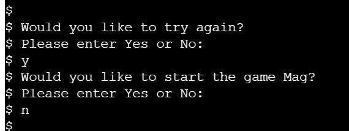

Features
======

### Run program button
<ul>
<li></li>
</ul>

### Terminal area
<ul>
<li></li>
</ul>

### Program structre
<ul>
<li></li>
</ul>

Testing
======

## Validator Testing

### PEP8
No errors were returned when passing through the PEP8 code validator

### Fixed Bugs or Issues
<ul>
<li>When a user made a choice in game that resulted in their death, they were met with an option to try again. If the user answered yes they were brought to the beginning of the game where they were asked again if they would like to play</li>
<li>This interaction ended up being very repetitive so the function was changed to start the story at a different stage when the user chose to try again</li>
</ul>

Deployment
======

The site was deployed to Heroku. The steps I used to deploy are as follows:

Before deploying I went though my code and added new line characters to the end of any text inside the input method. Without this extra line, the text for the input request will not show up in the terminal

Next in order for my project to run on Heroku, I needed to add dependencies for Heroku to install. To create my list of dependencies, I used the following command in the terminal 'Pip3 freeze > requirements.txt'.

I then had to create a new Heroku account. Once my account was created, I clicked on the button to create a new app. I picked a name for my app, selected my region and pressed the create app button

On the next page I went to the Settings tab. I did not have any sensitive information to keep hidden in my project so I did not need to add anything to the Config Vars section

My next step was to go to the Buildpacks section, this installs further dependencies that I needed, outside of the ones in the requirements.txt file. I pressed the Add buildpacks button and selected Heroku, then saved the changes. I then selected nodejs and saved the changes again.

Next I navigated to the Deployment section to choose my deployment method. I connected my Heroku account to Github, searched for my repository name and then clicked connect to link up my Heroku app to my Github repository code.

I then scrolled down and chose to Automatically deploy my project. From the source section drop-down menu, I selected the Main Branch and then I clicked the Enable Automatic Deploys button

I then had to wait for my app while it was being built and when it was done I saw an “App was  successfully deployed” message and a button to show my deployed link

The live link can be found here - https://haunted-house0.herokuapp.com/

Credits
======

### Content

When planning my project I visited a number of different sites to gain inspiration

https://www.youtube.com/watch?v=DEcFCn2ubSg&ab_channel=TechWithTim

https://www.youtube.com/watch?v=SH5-xJp1mY0&ab_channel=hundredvisionsguy

https://www.youtube.com/watch?v=IRg4G-iUD_I&ab_channel=SamRosenfeld

https://thecodingpie.com/post/make-your-own-text-based-adventure-game-in-python3

https://www.derekshidler.com/how-to-create-a-text-based-adventure-and-quiz-game-in-python/

### Acknowledgements

My mentor and tutor for continuous helpful feedback